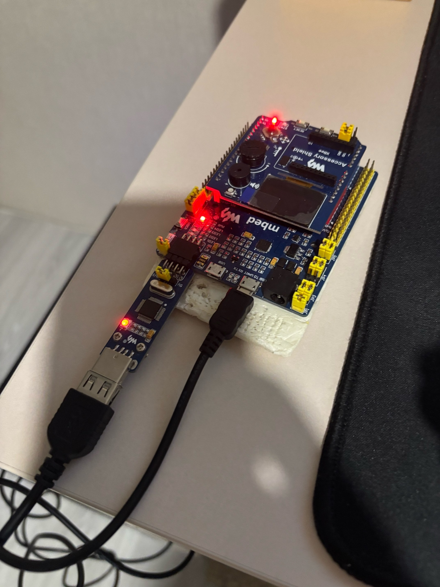

= Лабораторная работа 2
:toc: macro
:figure-caption: Рисунок

<<titulnik.adoc,Перейти к титульной странице>>

== Введение

В отчете рассматривается процесс превращения C++ кода в прошивку для микроконтроллера STM32F411. Основное внимание уделено этапам компиляции, линковки, инициализации системы до вызова main(), работе с памятью, а также настройке проектов и отладке в среде IAR Embedded Workbench for ARM.

== Процесс преобразования кода C++ в программу для микроконтроллера

Превращение кода C++ в работающую программу для микроконтроллера происходит в два основных этапа:

=== Этап компиляции (трансляции)
На данной стадии компилятор выполняет перевод исходного текста программы (файлы с расширениями .cpp и .h) в машинно-ориентированные объектные файлы. Параллельно может осуществляться генерация библиотек, предназначенных для их последующего многократного использования в других проектах.

=== Этап компоновки (линковки)
Задача линковщика заключается в объединении всех скомпилированных объектных файлов, стандартных библиотек языка и конфигурационных файлов проекта в единое целое. Финальным результатом его работы становится исполняемый модуль в формате ELF. Ключевой функцией линковщика является корректное распределение сегментов кода и данных по адресному пространству микроконтроллера (ПЗУ и ОЗУ) в строгом соответствии с заданными параметрами линковочного скрипта.

== Запуск программы: что происходит до main()

Перед запуском основной программы (main()) система выполняет критически важные подготовительные действия:

- **Инициализация стека**: указатель стека (SP) устанавливается на верхнюю границу области стека.
- **Инициализация переменных**:
  **Zero-initialized data**: глобальные переменные без явной инициализации обнуляются.
  **Initialized data**: переменные с начальными значениями копируются из ПЗУ в ОЗУ.
- **Вызов `main()`**: только после инициализации управление передаётся в функцию main().

== Роль файла startup.cpp

Файл startup.cpp (или estartup.cpp) содержит:
- Таблицу векторов прерываний.
- Код начальной инициализации системы.
- Точку входа __iar_program_start, которая вызывает __cmain, а затем main().

Пример структуры файла:
[source,cpp]
----
extern "C" void __iar_program_start(void);
void __iar_program_start(void) {
    __iar_init_core();
    __iar_init_vfp();
    __cmain();  // вызывает main()
}
----

== Отладка и загрузка

- Исполняемый файл загружается в микроконтроллер через отладчик (ST-LINK) или симулятор.
- IAR C-SPY позволяет отлаживать код на уровне исходников и ассемблера.
- Анализ стека помогает определить максимальный размер стека для глубоких цепочек вызовов.

=== Подключение платы к компу

== Заключение

Процесс от написания кода до его выполнения на микроконтроллере включает:
компиляцию и линковку,
настройку памяти и стека,
инициализацию системы до вызова main(),
загрузку и отладку через специализированные инструменты.
Использование продвинутых IDE, например, IAR Embedded Workbench, значительно автоматизирует эти процессы, минимизирует риски ошибок и ускоряет разработку, позволяя инженеру уделять основное внимание созданию алгоритмов и прикладной логики.
