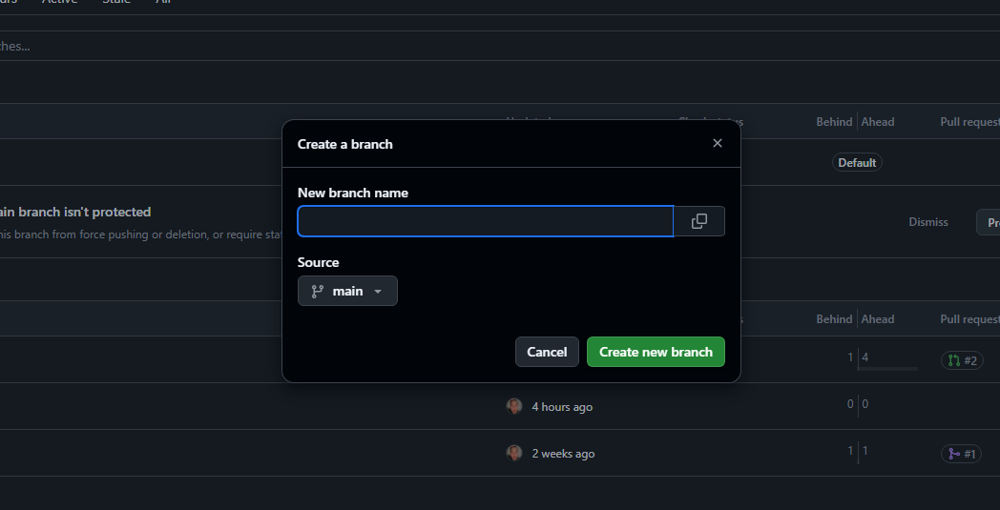
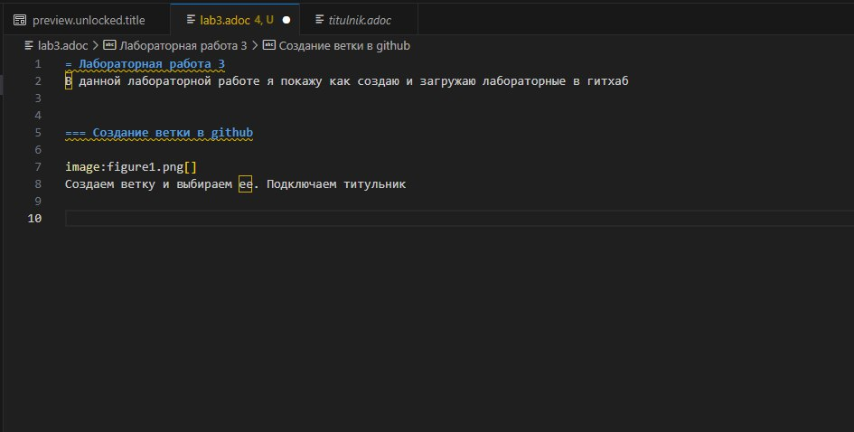
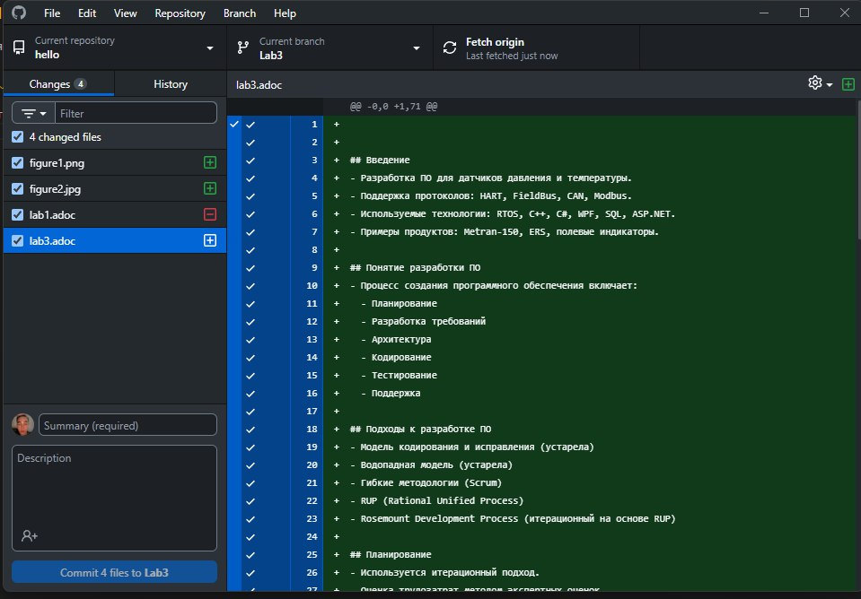
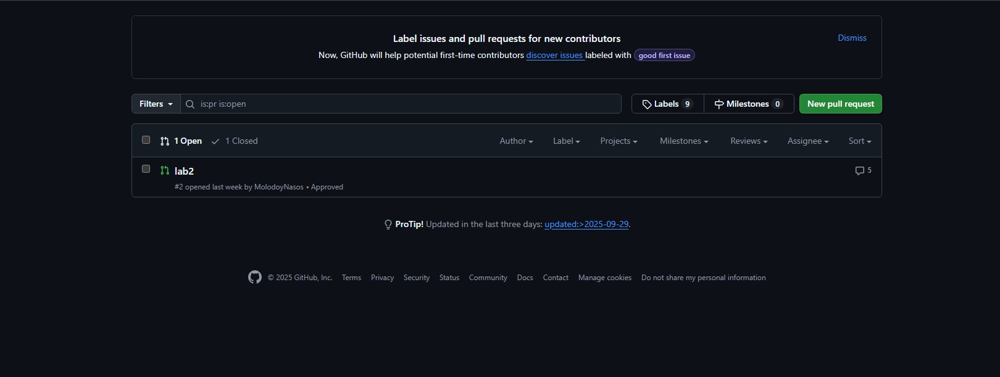

= Лабораторная работа 3
:toc: macro
:toc-title: ОГЛАВЛЕНИЕ
:figure-caption: Рисунок

include::titulnik.adoc[]

toc::[]

== Введение

В эпоху цифровизации эффективное управление проектами приобретает особую важность. Современные инструменты для контроля версий, такие как Git и его облачная платформа GitHub, позволяют разработчикам, техническим писателям и прочим участникам рабочих процессов организовывать совместную работу, отслеживать изменения и интегрировать различные версии проектов без потери данных и конфликтов. 

Visual Studio — одна из ведущих интегрированных сред разработки (IDE), предлагает встроенную поддержку систем контроля версий, что упрощает управление репозиториями и отправку изменений на удаленные серверы, включая GitHub. Для создания технической документации всё чаще используется формат AsciiDoc (.adoc), который наглядно и удобно структурирует текст и может быть интегрирован в процессы автоматической сборки документации.

В данном отчете подробно рассматривается работа с GitHub, создание веток в рамках git-репозитория, а также процесс отправки и управления текстовыми документами формата .adoc из среды Visual Studio.

Цель работы: 

* Ознакомление с основными принципами и возможностями GitHub для управления версиями проектов;

* Описание механизма создания и использования веток (branches) в git;

* Инструкции и рекомендация по созданию, редактированию и отправке текстовых файлов в формате .adoc с использованием Visual Studio;

* Формирование понимания полного процесса корректной работы с репозиторием для технической документации и кода.

== Pull request (PR)

1. Создаём отдельную ветку, где делаем свои изменения. Это как отдельная копия работы, чтобы главный проект не ломался.

2. Когда работа готова, мы ее коммитим со своими изменениями в этой ветке

3. Потом мы отправляем эту ветку на GitHub — туда, где хранится общий проект

4. После этого мы создаем pull request — запрос, который показывает всем, что у меня есть готовые изменения и просишь проверить их

5. Другие участники тоже могу коментить и добавлять замечания

6. Если все ок, то нашу ветку сливают с главной веткой проекта

== Commit - "Сохранить версию локально"

*Commit* - это точечное сохранение текущего состояния ваших файлов в локальный репозиторий Git. Это как сделать снимок (снапшот) всех изменений на данный момент и дать ему понятное описание.

*Зачем нужно?*

* Создать контрольную точку, к которой можно вернуться.

* Логически группировать изменения (например, "исправил баг входа" или "добавил новую кнопку").

* Готовить набор изменений для отправки на GitHub.

*Как сделать в VS Code:*

* Открываем Панель управления исходным кодом (иконка с веткой слева или Ctrl+Shift+G).

* Пишем сообщение коммита в поле ввода (например, "Add login form").

* Нажмите на галочку ✓ Commit или сделайте Commit & Sync (это сразу Commit + Push + Pull).

Важно: Коммит сохраняет изменения только у вас на компьютере. На GitHub ничего не изменится.

== Push - «Отправить изменения на сервер»

*Push (отправка)* - это процесс загрузки наших локальных коммитов из вашего компьютера в удаленный репозиторий на GitHub. Вы "проталкиваете" свои изменения в общее хранилище.

*Как сделать в VS Code:*

После коммита в правом нижнем углу VS Code появится индикатор, показывающий, на сколько коммитов ваша локальная ветка впереди удаленной.

* Нажимаем на этот индикатор или...

* Открываем панель управления исходным кодом и нажмите ... (многоточие) -> Push.

Ключевая фраза: "Я закоммитил изменения локально и теперь пушу их на GitHub".

== Pull - «Загрузить изменения с сервера»

Pull - это процесс получения последних изменений с удаленного репозитория (GitHub) и их автоматического слияния с вашей локальной версией на компьютере.

*Как сделать в VS Code:*

Если на GitHub есть изменения, которых нет у нас локально, в правом нижнем углу появится индикатор, показывающий, на сколько коммитов наша локальная ветка позади удаленной.

* Нажимаем на этот индикатор и выбираем Pull или...

* Открываем панель управления исходным кодом и нажимаем ... (многоточие) -> Pull.

Ключевая фраза: "Кто-то обновил код на GitHub, мне нужно сделать пул, чтобы скачать эти изменения к себе".

== Работа с комментариями
Вносим нужные правки в свой код или документацию у себя локально, в той же ветке, где создавался PR.

Делаем новый коммит с исправлениями и отправляем изменения на GitHub (push). Эти изменения автоматически добавятся к существующему PR.

Когда все комментарии учтены и одобрены, PR могут закрыть (слить) с главной веткой проекта. Это называют "слиянием" (merge). После слияния желательно удалить ветку в main, чтобы не засорять репозиторий.

== Создание ветки в github

Создаем ветку и выбираем ее. Подключаем титульник.

*Рисунок 1*

== Создание и формирование отчета в Visual Code

Формируем и сохраняем отчет с файлами в Visual Code. Делаем отчет.

*Рисунок 2*

== Экспорт отчета в github

После сохранения отчета, необходимо перенести его в гитхаб для проверки. 

Для этого нужно зайти в гитхаб десктоп, выбрать нужную лабу, обновить файлы, нажать commit и загрузить изменения на сайт.

*Рисунок 3*

== Проверка преподавателем

После загрузки наших файлов необходимо зайти на сайт, выбрать нашу загруженную лабу и нажать пулл реквест. Также необходимо добавить в смотрители Преподавателя, если не добавили. 
На скрине видно только лабу2, т.к. 3 еще не загрузил.

Если лабу проверили и ошибок нет, то нажимаем на squash and merge.

*Рисунок 4*

== ЗАКЛЮЧЕНИЕ

GitHub в комбинации с Visual Code представляет мощнейший инструмент для организации процесса создания, редактирования и управления проектами и технической документацией. Возможность создавать ветки облегчает параллельную работу над разными частями проекта, а интеграция с Visual Code обеспечивает удобный и интуитивно понятный процесс внесения изменений и их отправки на удаленный репозиторий.

Работа с файлами .adoc позволяет стандартизировать и структурировать текстовую документацию, что важно для крупных проектов и коллективов. Применение описанных методик значительно повышает эффективность командной разработки, снижает вероятность ошибок и упрощает поддержку проектов в долгосрочной перспективе.