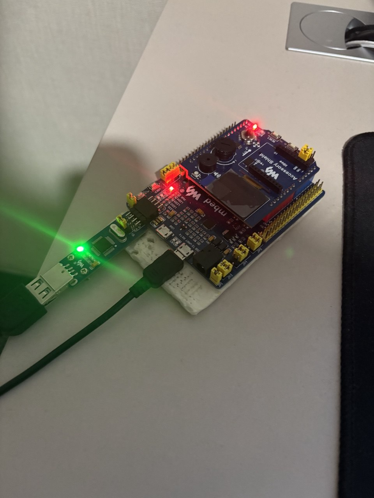
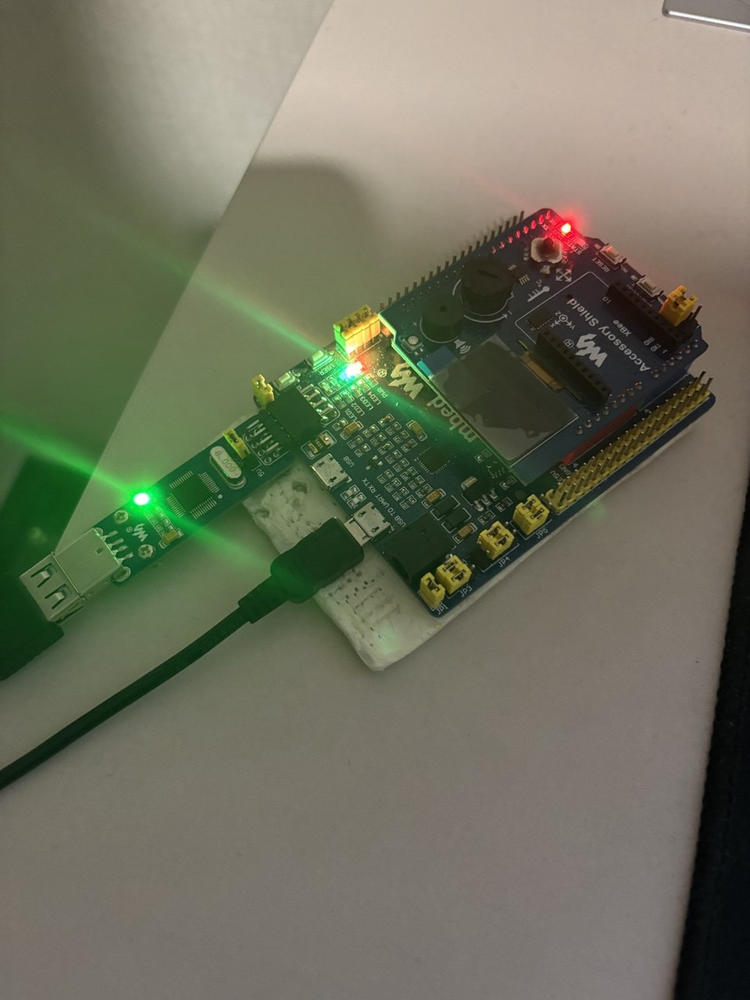

= Лабораторная работа 4
:toc: macro
:figure-caption: Рисунок

include::titulnik.adoc[]

toc::[]

== ВВЕДЕНИЕ

Переменные — это ключевой элемент программирования, предназначенный для хранения и обработки данных. Разнообразие данных, от простых чисел до сложных объектов, требует их чёткой классификации, для чего и используются типы переменных. В этой работе исследуются виды, назначение и особенности типов переменных, их роль в программировании и практическое применение в различных языках. Умение правильно работать с типами данных необходимо для написания надёжного и эффективного кода.

Практической частью работы станет создание программы для микроконтроллера, которая позволяет управлять светодиодом с помощью кнопки.

Цель работы: используя изученные типы переменных, написать код для микроконтроллера, реализующий переключение светодиода при нажатии кнопки.

== Типы данных

=== Базовые типы данных

В C++ существуют фундаментальные типы данных, среди которых:

bool — логический тип для хранения значений true/false (1 байт).

char — символьный тип (1 байт).

int — целочисленный тип (обычно 4 байта).

float — число с плавающей запятой одинарной точности (4 байта).

double — число с плавающей запятой двойной точности (8 байт).

=== Модификаторы типов

Поведение и размер базовых типов можно изменять с помощью модификаторов:

short — уменьшает размер типа (например, 2 байта для short int).

long — увеличивает размер типа (например, 8 байт для long long).

unsigned — указывает, что тип может хранить только неотрицательные значения.

=== Размеры типов данных

Размеры типов не четко определены и могут отличаться для различных микроконтроллеров. Для размеров
типов существует правило:
[.source, cpp]
----
1             <= sizeof(char)     <= sizeof(short) <= sizeof(int) <= sizeof(long)
1             <= sizeof(bool)     <= sizeof(long)
sizeof(char)  <= sizeof(long)
sizeof(float) <= sizeof(double)   <= sizeof(long double)
sizeof(T)     == sizeof(signed T) == sizeof(unsigned T)
----

Поэтому вместо прямых типов типа int, используйте псевдонимы, например:
[horizontal]
std::uint32_t:: целое беззнаковое длиной 32 бита
std::int64_t::  целое знаковое длинной 64 бита
std::uint8_t:: целое знаковое длинной 8 бит

== Преобравование типов

=== Неявное преобразование типов

Базовые/простые типы неявно можно привести друг к другу.

[.source, cpp]
----
int a = 0; # <1>

char a = 512; # <2>

int a = 3.14;  # <3>

bool a = -4;  # <4>

bool a  = 0;  # <5>

----

<1> Присваимаем знаковое целое(int) число переменной целого типа;

<2> Присваиваем знаковое целое(int) число переменной типа char. Результат в а 0 ;

<3> Присваиваем число с плавающей точкой(double) к переменной типа int. Результат в а 3;

<4> Присваиваем знаковое целое(int) к переменной типа bool. Результат в а true;

<5> Присваиваем знаковое целое(int) к переменной типа bool. Результат в а false.

=== Явное преобразование

Для точного контроля над преобразованиями следует использовать операторы приведения:

static_cast — для стандартных и безопасных преобразований.

reinterpret_cast — для низкоуровневых преобразований между несвязанными типами.

const_cast — для изменения константности переменной.

dynamic_cast — для безопасного приведения типов в иерархиях наследования.

Пример использования:

[source, cpp]

----

int a = static_cast<int>(3.14); // Явное преобразование в int
auto ptr = reinterpret_cast<volatile uint32_t*>(0x40010000); // Интерпретация числа как адреса

----

== Указатели

Указатель — это переменная, содержащая адрес другой переменной.

В языках программирования, особенно в C и C++, указатель - это специальный тип переменной, которая хранит адрес памяти. Чтобы создать указатель, пишут звездочку (*), например:

[.source, cpp]
----

int a = 10;     // обычная переменная с числом 10
int *p = &a;    // указатель p хранит адрес переменной a

----

Знак & означает "адрес переменной". Если теперь написать *p, то мы получим значение, на которое указывает указатель (то есть 10).

=== Операции над указателями

[.notes]
--
Указатели можно складывать, вычитать, сравнивать. Но указатели должны быть одного типа.
--

[source, cpp]

----
int main() {
  int  arr[] = {1,2,3,4,5} ;    # <1>
  int* ptr = arr ;              # <2>

  ptr ++ ;                      # <3>
  int a = *(ptr + 4) ;          # <4>
  if(ptr != nullptr)            # <5>
    cout << a << ": " << *ptr;  # <6>
}

----

<1> Объявление массива *arr* из 5 элементов. В целом можно считать, что массив *arr* это указатель на первый элемент массива;

<2> Обявления указателя на массив типа *int* ;

<3> Увеличиваем указатель на 1. На самом деле мы смещаемся по адресам на размер равный *size_of(int)*, т.е. на 4 байта. Т.е в данном случае указатель *ptr* стал указывать на элемент массива *arr[1]*;

<4> Объявляем переменную *а* типа *int* и присваиваем ей значение *аrr[4]*;

<5> Сравнение указателя с nullptr указателем;

<6> Вывод значения *а* и значения по адресу в указателе *ptr*. 

=== Сложение указателей

[source, cpp]

----

int main() {
  int  arr[] = {1,2,3,4,5} ;    # <1>
  int* ptr = arr ;              # <2>

  ptr ++ ;                      # <3>
  int a = *(ptr + 3) ;          # <4>
}

----

=== Константный указатель и указатель на константу

[source, cpp]

----
int main() {
  const auto pi[] = {3.14, 3.14159} ;
  const double *ptr = pi ;
  *ptr = 3.14159 ;                  # <1>
  ptr++ ;                           # <2>
  count << *ptr ;                   # <3>
  const double * const ptr1 = pi ;  # <4>
  ptr1++  ;                         # <5>
  retrun 0 ;
}
----
<1> Пытаемся поменять значение по указателю *ptr* (pi[0]). Ошибка, указатель на константу, нельзя
поменять значение константы;

<2> Увеличиваем указатель на 1 (теперь указатель указывает на p[1]);

<3> Вывод значения по указателю (3.14159);

<4> Объявляем константный указатель на константу;

<5> Нельзя изменить указатель, он константный.

== Ссылка

[source, cpp]

----
int main(){
  int a = 0;
  int &ref = a ;                # <1>
  ref = 10;                     # <2>
  cout << &ref << ": " << ref ; # <3>
  return 0 ;
}
----
<1> Объявляем ссылку на переменную *а*;

<2> Записываем в переменную *а* число 10;

<3> Выводим адрес перменной *а* и значение переменной *a*.

* У ссылки нельзя взять адрес. Если применить оператор взятия адреса к ней, то будет выведен адрес
переменной, на которую она ссылается;

* Ссылка ведет себя почти также как константный указатель. Её нельзя изменять, складывать, вычитать;

* Ссылки нельзя сравнивать;

* Ссылка не может быть не проинициализирована.

== Регистр

Регистры - это быстрая память внутри процессора. Они хранят данные, с которыми процессор работает. 

Вот главные особенности регистров:

* Обычно могут хранить 32 или 64 бита, то есть 4 или 8 байт (в нашем случае 4 байта);

* Регистры сразу доступны процессору, что дает сверхбыструю работу;

* Их число ограничено - в разных процессорах разное количество регистров.

Виды:

* *Регистры общего назначения* - сюда помещают данные или результаты вычислений;

* *Регистры специальных функций* - они управляют процессом работы процессора, например, текущее состояние, куда переходить дальше и т.п.

== Код программы

[source, cpp]

----
#include <iostream> // for std:: cout
#include "rccregisters.hpp" // for RCC
#include "gpioaregisters.hpp" // for GPIOA
#include "gpiocregisters.hpp" // for GPIOÑ

std::uint32_t SystemCoreClock = 16'000'000U;

extern "C" {
int __low_level_init(void)
{
  //Switch on external 16 MHz oscillator
  RCC::CR::HSION::On::Set();
  while (RCC::CR::HSIRDY::NotReady::IsSet())
  {

  }
  //Switch system clock on external oscillator
  RCC::CFGR::SW::Hsi::Set();
  while (!RCC::CFGR::SWS::Hsi::IsSet())
  {

  }
  
  RCC::APB2ENR::SYSCFGEN::Enable::Set();

  return 1;
}
}

void delay(int cycles)
{
  for(int i = 0; i < cycles; ++i)    
  {
    asm volatile("");
  }    
}

int main()
{  

  //0x4002 0810
  RCC::AHB1ENR::GPIOAEN::Enable::Set() ;
  RCC::AHB1ENR::GPIOCEN::Enable::Set() ;
  GPIOA::MODER::MODER5::Output::Set() ;
  GPIOC::MODER::MODER5::Output::Set() ;
  GPIOC::MODER::MODER8::Output::Set() ;
  GPIOC::MODER::MODER9::Output::Set() ;
  bool flag = false;
  for(;;)
  {
    
   std::uint32_t* const gpiocOdrPtr = reinterpret_cast<std::uint32_t*>(0x40020814);
   std::uint32_t* const gpiocIdrPtr = reinterpret_cast<std::uint32_t*>(0x40020810);
   auto volatile idrValue= *gpiocIdrPtr;
   bool isButtonPressed = ((idrValue & (1<<13))==0);
   if (isButtonPressed)
   {
     *gpiocOdrPtr^= (1<<5);
     *gpiocIdrPtr^= (1<<5);
   }

     delay(1000000);
     
   }
  
  return 1;
}
----

=== Данные иллюстрации демонстрируют что моя плата работает и еще не сгорела.

До нажатия кнопки:

После нажатия кнопки:

== ЗАКЛЮЧЕНИЕ

В этой работе я познакомился с разными типами переменных и понял, зачем они нужны в программах. На примере кнопки и светодиода я научился включать и выключать светодиод, используя переменные для запоминания состояния и отслеживания нажатия кнопки. 