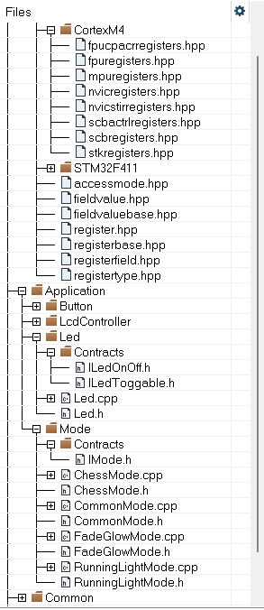

= Лабораторная работа №5

:toc: macro
:toc-title: Оглавление

include::titulnik.adoc[]

toc::[]

== Цель работы

Научится пользоватся классами в написании кода. Использование UML-диагарммы для демонстрации архетиктуры системы управления светодиодами.

== Задание

=== Написать ПО для управления светодиодами.

* По нажатию кнопки — менять режим работы 

=== Реализовать три режима: 
* «Моргание» — все светодиоды загораются и гаснут синхронно.  
* «Бегущий огонёк» — светодиоды зажигаются поочерёдно. 
* «Шахматка» — чётные и нечётные светодиоды работают в противофазе: одни горят, другие гаснут. Интеллектуальный режим для избранных.

== Введение
Данная лабораторная работа посвящена разработке системы управления светодиодами с поддержкой нескольких режимов работы. Основной целью проекта является демонстрация применения принципов объектно-ориентированного программирования и паттернов проектирования в контексте встраиваемых систем.
Система представляет собой контроллер для управления группой светодиодов с поддержкой нескольких режимов работы. Архитектура построена на основе объектно-ориентированного подхода с четким разделением ответственности между компонентами.

=== Основной рабочий цикл

[source,cpp]
----
for(;;)
  {   
    if (userButton.WasPressed())
    {
      modeController.SwitchMode(); 
    }
    delay(500000);
    modeController.RunCurrentMode(); 
  }
----

Реализованы три режима работы:

* **RunningLightMode** — последовательное переключение светодиодов (режим "бегущий огонь")
* **FadeGlowMode** — синхронное управление всеми светодиодами  
* **ChessMode** — попеременное включение светодиодов в шахматном порядке

Каждый режим инкапсулирует собственную логику управления, взаимодействуя со светодиодами исключительно через абстрактные интерфейсы.

== Обоснование выбора интерфейсов

=== Минималистичный дизайн IButton

Интерфейс IButton был спроектирован с фокусом на минимально необходимую функциональность:

[source,cpp]
----
class IButton {
public:
    virtual bool WasPressed() const = 0;
};
----

 Такой подход обеспечивает:
* Простоту реализации для различных аппаратных платформ
* Снижение связанности между компонентами из-за чего можно делать Unit-тесты

=== Разделение интерфейсов управления светодиодами

Изначально рассматривался  ILedToggable. Однако анализ сценариев использования выявил необходимость унифицированного интерфейса, объединяющего все возможные операции со светодиодами ILedOnOff:

[source,cpp]
----
class ILedToggable {
public:
    virtual void Toggle() const = 0;
};

class ILedOnOff {
public:
    virtual void On() const = 0;
    virtual void Off() const = 0;
};
----

**Техническое обоснование разделения:**

1. **RunningLightMode** требует только операции переключения состояния
2. **ChessMode** нуждается в явном управлении состоянием каждого светодиода
3. Соблюдение принципа разделения интерфейсов (Interface Segregation Principle)

Такой дизайн позволяет классам реализовывать только необходимую функциональность.

== Процесс определения абстракций

Проектирование архитектуры системы выполнялось итеративно, с постепенным выделением абстракций из первоначальной монолитной реализации.

=== Первоначальный подход

Начальная реализация представляла собой единый модуль, содержащий:

* Логику управления аппаратными светодиодами
* Обработку пользовательского ввода
* Реализацию всех режимов работы

Данный подход быстро продемонстрировал недостатки при попытке добавления новых функциональных возможностей.

=== Выявление ключевых абстракций

В процессе рефакторинга были идентифицированы и выделены следующие абстракции:

1. **Управление светодиодами** 
2. **Обработка пользовательского ввода** 
3. **Реализация режимов работы** 

=== Создание иерархии CommonMode

Анализ повторяющегося кода в различных режимах привел к созданию базового класса CommonMode, содержащего:

- Ссылки на управляемые светодиоды
- Текущий индекс активного светодиода
- Стандартную реализацию метода Init()

Данное решение устранило дублирование кода и упростило создание новых режимов.

=== Архитектурное преобразование

В процессе рефакторинга было осознано, что различные режимы работы представляют собой альтернативные алгоритмы достижения общей цели — управления светодиодами. Это понимание привело к созданию унифицированного интерфейса:

[source,cpp]
----
class IMode {
public:
    virtual void Init() = 0;
    virtual void Execute() = 0;
};
----

Контроллер режимов был переработан для работы с абстракциями:

[source,cpp]
----
void ModeController::RunCurrentMode() {
    mModes[mCurrentMode]->Execute();
}
----

=== Преимущества полученной архитектуры

1. Расширяемость — добавление нового режима требует только создания нового класса, реализующего интерфейс IMode
2. Тестируемость — каждый режим может тестироваться изолированно
3. Сопровождаемость — логика каждого режима инкапсулирована в отдельном классе
4. Чистота архитектуры — контроллер не зависит от конкретных реализаций режимов

=== Диаграмма классов системы

На представленной UML диаграмме классов отображена архитектура системы управления светодиодами. 
Диаграмма наглядно иллюстрирует применение принципов SOLID.

image::UML.png[]

== Выводы

Разработанная система управления светодиодами демонстрирует эффективное применение объектно-ориентированных принципов проектирования в контексте встраиваемых систем.
Полученная архитектура обеспечивает простоту добавления новых режимов работы и может быть адаптирована для управления различными типами исполнительных устройств.

== Приложение:

=== Расположение файлов 

=== Код main.cpp

[source,cpp]
----
#include "iostream"
#include "rccregisters.hpp"
#include "gpioaregisters.hpp"
#include "gpiocregisters.hpp"
#include <array>
#include "Led.h"
#include "OptimizedLed.h"
#include "CommonMode.h"
#include "RunningLightMode.h"
#include "FadeGlowMode.h" 
#include "ChessMode.h" 
#include "UserButton.h" 
#include "ModeController.h"

std::uint32_t SystemCoreClock = 16'000'000U;

extern "C" {
int __low_level_init(void)
{
  RCC::CR::HSION::On::Set();
  while (RCC::CR::HSIRDY::NotReady::IsSet())
  {

  }
  RCC::CFGR::SW::Hsi::Set();
  while (!RCC::CFGR::SWS::Hsi::IsSet())
  {

  }
  
  RCC::APB2ENR::SYSCFGEN::Enable::Set();

  return 1;
}
}

void delay(int cycles)
{
  for(int i = 0; i < cycles; ++i)    
  {
    asm volatile("");
  }    
}
constexpr std::uint32_t buttonPinNum = 13;
constexpr std::uint32_t portCIdrAddress = 0x40020810U;
UserButton userButton(buttonPinNum, portCIdrAddress);

Led led1(5, 0x40020814U);
Led led2(8, 0x40020814U);
Led led3(9, 0x40020814U);
OptimizedLed<0x40020014U, 5> led4;

tLeds leds = 
{
  &led1,
  &led2,
  &led3,
  &led4
};

tLedsOnOff ledsOnOff = 
{
  &led1,
  &led2,
  &led3,
  &led4
};

RunningLightMode runningLightMode(leds, ledsOnOff);
FadeGlowMode fadeGlowMode(leds, ledsOnOff);
ChessMode chessMode(leds, ledsOnOff);

tModes modes
{
  &runningLightMode,
  &fadeGlowMode,
  &chessMode
};

ModeController modeController(modes);

int main()
{ 
 
  RCC::AHB1ENR::GPIOAEN::Enable::Set() ;
  RCC::AHB1ENR::GPIOCEN::Enable::Set() ;
  GPIOA::MODER::MODER5::Output::Set() ;
  GPIOC::MODER::MODER5::Output::Set() ;
  GPIOC::MODER::MODER8::Output::Set() ;
  GPIOC::MODER::MODER9::Output::Set() ;
  
  for(;;)
  {   
    if (userButton.WasPressed())
    {
      modeController.SwitchMode(); 
    }
    delay(500000);
    modeController.RunCurrentMode(); 
  }
  return 1;
}

----
=== IButton.h

[source,cpp]
----
#if !defined(IBUTTON_H)
#define IBUTTON_H

class IButton
{
public:
    virtual bool WasPressed() const = 0;
};

#endif 
----

=== UserButton.cpp

[source,cpp]
----
#include "UserButton.h"
#include <cstdint>

UserButton::UserButton(std::uint32_t pinNum, std::uint32_t registerAddress)
    : mPinNum(pinNum)
    , mRegisterAddress(registerAddress)
{
  
}

bool UserButton::WasPressed() const
{
    bool isButtonPressed = ((*reinterpret_cast<std::uint32_t*>(mRegisterAddress) & (1U << mPinNum)) == 0);
    return isButtonPressed;
}
----

=== UserButton.h

[source,cpp]
----
#if !defined(USERBUTTON_H)
#define USERBUTTON_H

#include "IButton.h"
#include <cstdint>

class UserButton : public IButton
{
public:
    UserButton(std::uint32_t pinNum, std::uint32_t registerAddress);
    bool WasPressed() const override;

private:
    std::uint32_t mRegisterAddress;
    std::uint32_t mPinNum;
};

#endif
----

=== IController.h

[source,cpp]
----
#if !defined(ILEDTONOFF_H)
#define ILEDTONOFF_H
#include "ILedToggable.h"
#include <array>// for std::array
#include <cstdint>

class ILedOnOff 
{
public:
  virtual void On() const = 0;
  virtual void Off() const = 0;
};
using tLedsOnOff = std::array<ILedOnOff*, ledsCount>;
#endif
----

=== ModeController.cpp

[source,cpp]
----
#include <cassert>
#include "ModeController.h"

ModeController::ModeController(const tModes& modes):
    mModes(modes),
    mCurrentMode(0)
    {
      
    }
    void ModeController::SwitchMode() 
    {
      mCurrentMode++;
        if (mCurrentMode == std::size(mModes))
        {
          mCurrentMode = 0;
        }
        mModes[mCurrentMode]->Init();
    }
    void ModeController::RunCurrentMode() 
    {
      mModes[mCurrentMode]->Execute();
    }
----

=== ModeController.h

[source,cpp]
----
#if !defined(MODECONTROLLER_H)
#define MODECONTROLLER_H

#include "IController.h"
#include "IMode.h"       
#include <array>         

const std::uint32_t modesCount = 3;
using tModes = std::array<IMode*, modesCount>;

class ModeController : public IController
{
public:
    ModeController(const tModes& modes);
    void SwitchMode() override;
    void RunCurrentMode() override;

private:
    const tModes mModes;
    std::uint32_t mCurrentMode;
};

#endif
----

=== ILedOnOff.h

[source,cpp]
----
#if !defined(ILEDTONOFF_H)
#define ILEDTONOFF_H
#include "ILedToggable.h"
#include <array>
#include <cstdint>

class ILedOnOff 
{
public:
  virtual void On() const = 0;
  virtual void Off() const = 0;
};
using tLedsOnOff = std::array<ILedOnOff*, ledsCount>;
#endif
----

=== ILedToggable.h

[source,cpp]
----
#if !defined(ILEDTOGGABLE_H)
#define ILEDTOGGABLE_H
#include <array>

class ILedToggable
{
  public:
    virtual void Toggle() const = 0;
};
const auto ledsCount = static_cast<std::size_t>(4);
using tLeds = std::array<ILedToggable*, ledsCount>;
#endif
----

=== Led.cpp

[source,cpp]
----
#include "Led.h"
#include <cassert>

Led::Led(std::uint32_t pinNum, std::uint32_t registerAddress):
      mPinNum(pinNum),
      mRegisterPtr(reinterpret_cast<std::uint32_t*>(registerAddress))
    {
      
    }
    void Led::Toggle() const 
    {
      assert(mPinNum <= 15);
      *mRegisterPtr ^= (1 << mPinNum);
    }
    void Led::On () const 
    {
      *mRegisterPtr |= (1 << mPinNum);
    }
    void Led::Off () const 
    {
      *mRegisterPtr &= ~(1 << mPinNum);
    }
----

=== Led.h

[source,cpp]
----
#if !defined(LED_H)
#define LED_H
#include "ILedToggable.h"
#include "ILedOnOff.h"
#include <cstdint>

class Led: public ILedToggable, public ILedOnOff
  {
  public:
    Led(std::uint32_t pinNum, std::uint32_t registerAddress);
    void Toggle() const override; 
    void On () const override;
    void Off () const override;
  private:
    std::uint32_t mPinNum;
    std::uint32_t* const mRegisterPtr;
    
  };
  #endif
----

=== OptimizedLed.h

[source,cpp]
----
#if !defined(OPTIMIZEDLED_H)
#define OPTIMIZEDLED_H
#include "ILedToggable.h"
#include "ILedOnOff.h"
#include <cstdint> 

template <std::uint32_t registerAddress, std::uint32_t pinNum>
class OptimizedLed: public ILedToggable, public ILedOnOff 
{
public:
  void Toggle() const override
  {
    static_assert(pinNum <= 15, "номер пина не может быть больше 15");
    auto const ptrRegister = reinterpret_cast<volatile std::uint32_t*>(registerAddress);
    *ptrRegister ^= (1U << pinNum);
  }
  void On () const override
  {
    static_assert(pinNum <= 15, "номер пина не может быть больше 15");
    auto const ptrRegister = reinterpret_cast<volatile std::uint32_t*>(registerAddress);
    *ptrRegister |= (1U << pinNum);
  }
  void Off () const override
  {
    static_assert(pinNum <= 15, "номер пина не может быть больше 15");
    auto const ptrRegister = reinterpret_cast<volatile std::uint32_t*>(registerAddress);
    *ptrRegister &= ~(1U << pinNum);
  }
};
#endif
----

=== ChessMode.cpp

[source,cpp]
----
#include <cstdint>
#include "ChessMode.h"
  ChessMode::ChessMode(const tLeds& leds, const tLedsOnOff& ledsOnOff):
CommonMode(leds, ledsOnOff)
    {
      
    }
void ChessMode::Execute()
{
    for (std::size_t i = 0; i < std::size(mLeds); ++i)
    {
        if ((i % 2 == 0) == oddPhase)
            mLedsOnOff[i]->On();
        else
            mLedsOnOff[i]->Off();
    }
    oddPhase = !oddPhase;
}
----

=== ChessMode.h

[source,cpp]
----
#if !defined(CHESSMODE_H)
#define CHESSMODE_H
#include "ILedToggable.h"
#include "ILedOnOff.h"
#include <cstdint>
#include "IMode.h"
#include "CommonMode.h"
#include <array>
class ChessMode : public CommonMode
{
public:
  ChessMode(const tLeds& leds, const tLedsOnOff& ledsOnOff);
    void Execute() override;
    
private:
    bool oddPhase = false;
};
#endif
----

=== CommonMode.cpp

[source,cpp]
----
#include "CommonMode.h"
#include "Led.h"
#include <cassert>
#include "ILedToggable.h"
#include "ILedOnOff.h"

CommonMode::CommonMode(const tLeds& leds, const tLedsOnOff& ledsOnOff):
    mLeds(leds),
    mLedsOnOff(ledsOnOff),
    mCurrentLedNumber(0)
    {
      
    }
void CommonMode::Init()
    {
      mCurrentLedNumber = 0;
      for (auto it: mLedsOnOff)
      {
        it->Off();
      }
    }
----

=== CommonMode.h

[source,cpp]
----
#if !defined(COMMONMODE_H)
#define COMMONMODE_H
#include "IMode.h"
#include <cstdint>
#include "ILedToggable.h"
#include "ILedOnOff.h"

class CommonMode: public IMode
{
public:
  CommonMode(const tLeds& leds, const tLedsOnOff& ledsOnOff);
  void Init() override;
protected:
  const tLeds& mLeds;
  const tLedsOnOff& mLedsOnOff; 
  std::uint32_t mCurrentLedNumber;
};
#endif
----

=== FadeGlowMode.cpp

[source,cpp]
----
#include <cstdint>
#include "FadeGlowMode.h"
FadeGlowMode::FadeGlowMode(const tLeds& leds, const tLedsOnOff& ledsOnOff):
CommonMode(leds, ledsOnOff)
    {
      
    }
void FadeGlowMode::Execute()
    {
      for(auto it: mLeds)
      {
        mLeds[mCurrentLedNumber++]->Toggle();
        if (mCurrentLedNumber == std::size(mLeds))
        {
          mCurrentLedNumber = 0;
        }
      }
    }
----

=== FadeGlowMode.h

[source,cpp]
----
#if !defined(FADEGLOWMODE_H)
#define FADEGLOWMODE_H
#include "ILedToggable.h"
#include "ILedOnOff.h"
#include <cstdint>
#include "IMode.h"
#include "CommonMode.h"
#include <array>
class FadeGlowMode : public CommonMode
{
public:
  FadeGlowMode(const tLeds& leds, const tLedsOnOff& ledsOnOff);
    void Execute() override;
};
#endif
----

=== RunningLightMode.cpp

[source,cpp]
----
#include <cassert>
#include "RunningLightMode.h"
#include "ILedToggable.h"
#include "ILedOnOff.h"

RunningLightMode::RunningLightMode(const tLeds& leds, const tLedsOnOff& ledsOnOff):
    CommonMode(leds, ledsOnOff)
    {
      
    }
void RunningLightMode::RunningLightMode::Execute()
    {
    mLeds[mCurrentLedNumber++]->Toggle();
    if (mCurrentLedNumber == std::size(mLeds))
    {
      mCurrentLedNumber = 0;
    }
  }

----

=== RunningLightMode.h

[source,cpp]
----
#if !defined(RUNNINGLIGHTMODE_H)
#define RUNNINGLIGHTMODE_H
#include "CommonMode.h"
#include "ILedToggable.h"
#include "ILedOnOff.h"

class RunningLightMode : public CommonMode
{
public:
  RunningLightMode(const tLeds& leds, const tLedsOnOff& ledsOnOff);
  void Execute() override;
};

#endif
----