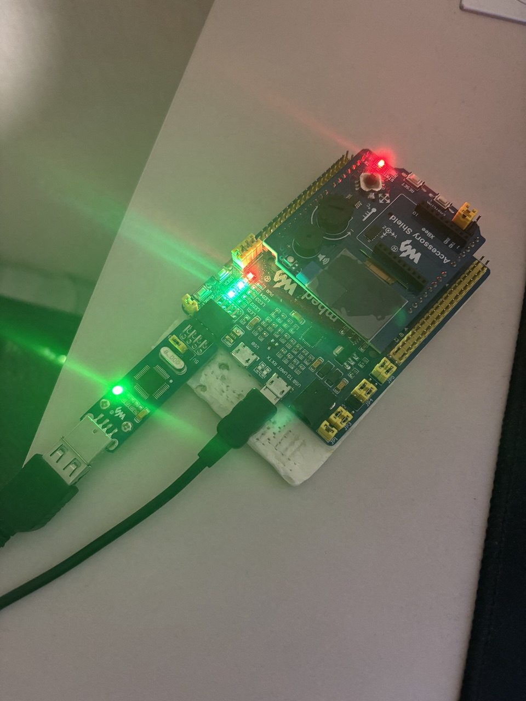

= Лабораторная работа 6
:toc: macro
:figure-caption: Рисунок

include::titulnik.adoc[]

toc::[]

== Введение

Цель работы:

- переключение на внешний высокочастотный PLL;
- написать о системе тактирования микроконтроллера;
- настройка портов ввода/вывода;
- работа с системным таймером (SysTick) и таймерами общего назначения (TIM2);

== 1. Система тактирования STM32F411

=== 1.1 Источники тактирования

Микроконтроллер STM32F411 поддерживает несколько источников тактовой частоты:

1. **HSI (High Speed Internal)** — внутренний RC-генератор 16 МГц.
2. **HSE (High Speed External)** — внешний кварцевый резонатор (8 МГц).
3. **PLL (Phase Locked Loop)** — система фазовой автоподстройки, набор из умножителей и делителей, где на выходы получаем частоту HSI или HSE.
4. **LSI/LSE** — низкочастотные генераторы для RTC и сторожевых таймеров.

image:system.png[]

*Рисунок 1: Структура системы тактирования STM32F411*

=== 1.2 Настройка на внешний высокочастотный генератор PLL
Поменял значение RCC_PLLCFGR_PLLM_Values в папке rccregisters.hpp, т.к. регистр PLLM в нем имел неверную информацию.

[source,cpp]
----
using PLLQ0 = RCC_PLLCFGR_PLLQ_Values<RCC::PLLCFGR, 24, 4, ReadWriteMode, RCCPLLCFGRBase> ;
    using PLLSRC = RCC_PLLCFGR_PLLSRC_Values<RCC::PLLCFGR, 22, 1, ReadWriteMode, RCCPLLCFGRBase> ;
    using PLLP = RCC_PLLCFGR_PLLP_Values<RCC::PLLCFGR, 16, 2, ReadWriteMode, RCCPLLCFGRBase> ;
    using PLLN = RCC_PLLCFGR_PLLN_Values<RCC::PLLCFGR, 6, 9, ReadWriteMode, RCCPLLCFGRBase> ;
    using PLLM = RCC_PLLCFGR_PLLM_Values<RCC::PLLCFGR, 0, 5, NoAccess, NoAccess> ;
----
.Регистр PLLM
image:PLL.png[]
*Рисунок 2: Регистр PLLM*

Затем с помощью регистров PLLM, PLLN,PLLP подобрали частоту. В нашем случае необходимо получить f = 32Мгц, для этого подберем PLLM, PLLN,PLLP такие, чтобы выполнялась формула:

f = f(PLL clock input) × (PLLN / PLLM) /PLLP​;
32Мгц = 8*64/2/8;

image:formula.png[]

*Рисунок 3: Фазовая подстройка частоты PLL*

Подобрали регистры. Дальше выполню все необходимые шаги для переключения на HSE:

- *Шаг 1. Включение внешнего кварца (HSE)*
- *Шаг 2. Переключение на HSE как системную частоту*
- *Шаг 3. Настройка PLL (Phase-Locked Loop)*
- *Шаг 4. Запуск PLL и переключение на него*
- *Шаг 5. Включение системного контроллера*
[source,cpp]
----
extern "C"
{
int __low_level_init(void)
{
  RCC::CR::HSEON::On::Set();
  while (RCC::CR::HSERDY::NotReady::IsSet())
  {
  }
  RCC::CFGR::SW::Hse::Set();
  while (!RCC::CFGR::SWS::Hse::IsSet())
  {

  }  
  RCC::CR::HSION::Off::Set();
  RCC::PLLCFGR::PLLSRC::HseSource::Set(); 
  RCC::PLLCFGR::PLLM::Set(2U);     // M = 2 
  RCC::PLLCFGR::PLLN::Set(64U);    // N = 64 
  RCC::PLLCFGR::PLLP::Set(3U);     // P = 8 
  RCC::CR::PLLON::On::Set();
  while (RCC::CR::PLLRDY::Unclocked::IsSet())
  {
  }
  RCC::CFGR::SW::Pll::Set();
  while (!RCC::CFGR::SWS::Pll::IsSet())
  {
  }
  RCC::APB2ENR::SYSCFGEN::Enable::Set();
  return 1;
}
}
----

=== 1.3 Алгоритм настройки на внутренний генератор частоты

Пример настройки на HSI 16 МГц:

- *Шаг 1. Инициализация переменной SystemCoreClock - у нас 16Мгц*
- *Шаг 2. Включение внутреннего генератора HSI - HSION::On::Set()*
- *Шаг 3. Переключение системной частоты на HSI - SW::Hsi::Set()*
- *Шаг 4. Включение системного контроллера - RCC::APB2ENR::SYSCFGEN::Enable::Set()*

[source,cpp]
----
std::uint32_t SystemCoreClock = 16'000'000U;
extern "C" {
int __low_level_init(void)
{
  //Switch on external 16 MHz oscillator
  RCC::CR::HSION::On::Set();
  while (RCC::CR::HSIRDY::NotReady::IsSet())
  {
  }
  //Switch system clock on external oscillator
  RCC::CFGR::SW::Hsi::Set();
  while (!RCC::CFGR::SWS::Hsi::IsSet())
  {
  }
  RCC::APB2ENR::SYSCFGEN::Enable::Set();
  return 1;
}
}
----

== 2. Порты ввода/вывода (GPIO)

=== 2.1 Режимы работы портов

Каждый вывод GPIO может работать в нескольких режимах:

- **Вход** (аналоговый, цифровой с подтяжкой к питанию/земле)
- **Выход** (Push-Pull, Open-Drain)
- **Альтернативная функция** (для таймеров, UART, SPI и др.)
- **Аналоговый** (чтение сигналов, генерация аналоговых сигналов, аналоговые компараторы)

=== 2.2 Регистры управления

Основные регистры для настройки порта:

- **GPIOx_MODER** — выбор режима
- **GPIOx_OTYPER** — тип выхода (Push-Pull/Open-Drain)
- **GPIOx_OSPEEDR** — скорость переключения
- **GPIOx_PUPDR** — подтяжка
- **GPIOx_ODR** — выходные данные
- **GPIOx_IDR** — входные данные

Пример настройки вывода как выход Push-Pull:

[source,cpp]
----
// Включаем тактирование порта C
RCC::AHB1ENR::GPIOCEN::Enable::Set();

// Настраиваем вывод 5 как выход
GPIOC::MODER::MODER5::Output::Set();

// Тип выхода — Push-Pull (по умолчанию)
GPIOC::OTYPER::OT5::PushPull::Set();

// Скорость переключения — высокая
GPIOC::OSPEEDR::OSPEEDR5::VeryHigh::Set();

// Устанавливаем высокий уровень
GPIOC::ODR::ODR5::High::Set();
----

== 3. Таймеры

=== 3.1 Системный таймер (SysTick)

Самым простым таймером является - системный, встроенный в ядро ARMv7, на котором построено ядро CortexM4 и наш микроконтроллер stm32F411

**Регистры SysTick**:

- **SYST_CSR** — управление
- **SYST_LOAD** — значение перезагрузки
- **SYST_VAL** — текущее значение

Пример настройки SysTick:

[source,cpp]
----
// Настройка SysTick на прерывание каждые 1 мс (при частоте 16 МГц)
void SysTick_Init(void) {
    SysTick->LOAD = 16000 - 1;     // 16 МГц / 1000 Гц - 1 = 15999
    SysTick->VAL = 0;              // Сбросить текущее значение
    SysTick->CTRL = SysTick_CTRL_TICKINT_Msk |  // Включить прерывания                  
}

// Обработчик прерывания SysTick (вызывается каждую 1 мс)
volatile uint32_t ticks = 0;
extern "C" void SysTick_Handler(void) {
    ticks++;  // Просто считаем миллисекунды
}

// Функция задержки на основе SysTick
void Delay_ms(uint32_t ms) {
    uint32_t start = ticks;
    while ((ticks - start) < ms) {
        // Ждём...
    }
}
----

Алгоритм таймера:

* *Конфигурация.* В регистр LOAD записывается значение, соответствующее требуемому интервалу времени. Для генерации прерывания каждую миллисекунду при частоте процессора 16 МГц вычисляется: (16 000 000 / 1000) - 1 = 15999.

* *Инициализация счетчика.* Регистр VAL обнуляется, устанавливая начальное значение счетчика в ноль.

* *Запуск таймера.* В регистр CTRL записываются управляющие биты: TICKINT, CLKSOURCE, ENABLE.

* *Рабочий цикл.* Счетчик начинает уменьшаться с заданной скоростью (на 1 за каждый такт процессора).

* *Обработка прерывания.* Выполняется код обработчика прерывания, в данном случае инкрементируется глобальная переменная-счетчик.

* *Использование для задержек.* Функция задержки отслеживает изменение счетчика, реализуя пассивное ожидание заданного интервала времени.

=== 3.2 Таймер общего назначения TIM2

TIM2 — 32-битный таймер, может работать в режимах:

- Счёт вверх/вниз
- ШИМ-генерация
- Захват/сравнение

**Основные регистры**:

- **TIM2_CR1** — управление
- **TIM2_PSC** — предделитель частоты
- **TIM2_ARR** — авто-перезагрузка
- **TIM2_CNT** — счётчик
- **TIM2_SR** — статус

image:registri.png[]

*Рисунок 4: Структура регистров TIM2*

Пример настройки таймера:

[source,cpp]
----
// Проверяет, прошло ли время
bool IsTimeoutExpired()
{
  if (TIM2::SR::UIF::InterruptPending::IsSet()) // Если флаг поднят
  {
    TIM2::SR::UIF::Set(0); // Опускаем флажок
    return true; // Говорим, что время вышло
  }
  return false; // Время еще не вышло
}

// Ставит таймер на нужное время
void SetTimeout(std::uint32_t delayInms)
{
  TIM2::PSC::Set(timPresc - 1U); // Настраиваем делитель частоты
  TIM2::ARR::Write(delayInms * timPeriod); // Говорим, сколько тиков ждать
  TIM2::SR::UIF::Set(0); // Сбрасываем флаг (на всякий случай)
  TIM2::CNT::Set(0); // Обнуляем счетчик
  TIM2::CR1::CEN::Set(1); // Запускаем таймер
}
----

В главной программе используем это так:

[source,cpp]
----
SetTimeout(200U); // Поставили таймер на 200 мс

for(;;) // Бесконечный цикл
{  
  if (IsTimeoutExpired()) // Каждые 200 мс здесь будет true
  {
    if (userButton.WasPressed()) // Проверяем кнопку
    {
      modeController.SwitchMode(); // Меняем режим мигания
    }
    modeController.RunCurrentMode(); // Делаем что должен делать текущий режим
  } 
}
----

Алгоритм работы таймера:

1. *Частота*: У нас процессор работает на 16 МГц (HSI). Мы не стали его делить, так что таймер тоже тикает 16 миллионов раз в секунду.

2. *Считаем тики*: Для 1 мс нужно 16,000 тиков (16,000,000 / 1000). Вот откуда взялось число 15,999 в формуле — потому что счет начинается с нуля.

3. *Ставим будильник*: Когда мы говорим *SetTimeout(200)* таймеру это означает: "Проснись через 200 × 16,000 = 3,200,000 тиков".

4. *Ждем звонка*: Таймер тикает, тикает, и когда досчитывает до нужного числа — поднимает флажок (UIF). Мы в основном цикле постоянно спрашиваем: "Флажок поднят?" Когда видим, что поднят — опускаем его и делаем свои дела.

5. *Фишка*: Раньше мы каждый раз заводили и останавливали таймер. Сейчас он работает постоянно. Это как часы на руке — они всегда идут, а мы просто смотрим на них, когда нужно.

6. *Про кнопку*: Мы проверяем кнопку не постоянно, а раз в 200 мс. Это достаточно часто, чтобы пользователь не заметил задержку, и достаточно редко, чтобы не ловить дребезг контактов.

== Заключение
В ходе лабораторной работы были выполнены ключевые задачи по работе с микроконтроллером STM32F411: переход на внешний тактовый генератор HSE с использованием PLL для повышения частоты до 32 МГц, настройка портов ввода/вывода для управления светодиодами и кнопкой, а также применение таймера TIM2 для реализации точных временных задержек. Была разработана программа, позволяющая переключать режимы работы светодиодов с использованием таймерной задержки и обработки нажатий кнопки.

=== Полный код программы

[source,cpp]

----
#include "iostream" //for std::cout
#include "rccregisters.hpp" // for RCC
#include "gpioaregisters.hpp" // for GPIOA
#include "gpiocregisters.hpp" // for GPIOC
#include <array> // for std::array
#include "Led.h" // for Led, ILedToggable, ILedOnOff
#include "OptimizedLed.h" // for OptimizedLed
#include "CommonMode.h"
#include "RunningLightMode.h"
#include "FadeGlowMode.h"
#include "ChessMode.h"
#include "UserButton.h"
#include "ModeController.h"
#include "tim2registers.hpp" // ??? TIM2

std::uint32_t SystemCoreClock = 32'000'000U;

extern "C"
{
int __low_level_init(void)
{
  RCC::CR::HSEON::On::Set();
  while (RCC::CR::HSERDY::NotReady::IsSet())
  {
  }
  RCC::CFGR::SW::Hse::Set();
  while (!RCC::CFGR::SWS::Hse::IsSet())
  {
  }  
  RCC::CR::HSION::Off::Set();
  RCC::PLLCFGR::PLLSRC::HseSource::Set(); 
  RCC::PLLCFGR::PLLM::Set(2U);     // M = 2 
  RCC::PLLCFGR::PLLN::Set(64U);    // N = 64 
  RCC::PLLCFGR::PLLP::Set(3U);     // P = 8 
  RCC::CR::PLLON::On::Set();
  while (RCC::CR::PLLRDY::Unclocked::IsSet())
  {
  }
  RCC::CFGR::SW::Pll::Set();
  while (!RCC::CFGR::SWS::Pll::IsSet())
  {
  }
  RCC::APB2ENR::SYSCFGEN::Enable::Set();

  RCC::APB1ENR::TIM2EN::Enable::Set();
  return 1;
}
}
void tim2_delay(std::uint32_t milliseconds)
{
  TIM2::CR1::URS::OverflowEvent::Set();
  TIM2::PSC::Write(31999U); 
  TIM2::ARR::Write(milliseconds - 1U);
  TIM2::SR::UIF::NoInterruptPending::Set();
  TIM2::CNT::Write(0);
  TIM2::CR1::CEN::Enable::Set();
  
  while (!TIM2::SR::UIF::InterruptPending::IsSet())
  {
  }
  TIM2::CR1::CEN::Disable::Set();
}
constexpr std::uint32_t buttonPinNum = 13;
constexpr std::uint32_t portCIdrAddress = 0x40020810U;
UserButton userButton(buttonPinNum, portCIdrAddress);

Led led1(5, 0x40020814U);
Led led2(8, 0x40020814U);
Led led3(9, 0x40020814U);
OptimizedLed<0x40020014U, 5> led4;

tLeds leds = 
{
  &led1,
  &led2,
  &led3,
  &led4
};
tLedsOnOff ledsOnOff = 
{
  &led1,
  &led2,
  &led3,
  &led4
};
RunningLightMode runningLightMode(leds, ledsOnOff);
FadeGlowMode fadeGlowMode(leds, ledsOnOff);
ChessMode chessMode(leds, ledsOnOff);

tModes modes
{
  &runningLightMode,
  &fadeGlowMode,
  &chessMode
};
ModeController modeController(modes);

int main()
{ 
  RCC::AHB1ENR::GPIOAEN::Enable::Set();
  RCC::AHB1ENR::GPIOCEN::Enable::Set();
  GPIOA::MODER::MODER5::Output::Set();
  GPIOC::MODER::MODER5::Output::Set();
  GPIOC::MODER::MODER8::Output::Set();
  GPIOC::MODER::MODER9::Output::Set();
  for(;;)
  {   
    if (userButton.WasPressed())
    {   
      modeController.SwitchMode(); 
    }
    modeController.RunCurrentMode(); 
    tim2_delay(150);
  }
  
  return 1;
}
----
